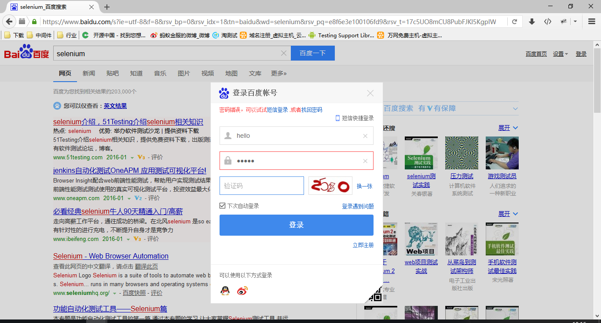

# fitenium 

## 一些介绍
+ fitenium把fitnesse与seleniumt衔接了起来，允许用户在fitnesse上编写WEB UI测试脚本，充分利用了fitnesse和selenium的优点
+ fitenium允许用户使用页面上关键字对WEB元素进行定位
    - 不需要了解xpath或者css selector也可进行WEB自动化测试开发
    - 使用页面关键字也相对稳定（用过xpath/css selector的同学肯定都深有体会)
    - 使用方便，只需要记住几个常用方法即可
+ 其实不只是支持fitnesse了，还支持excel和xml格式的测试用例（还是算了，谁会用xml写测试用例）
+ 支持json格式测试结果
+ 支持页面元素验证

## 后续开发
+ 支持selenium grid
+ 支持数据驱动

## 编译
 


## 上手
1. 设置好selenium运行环境，具体方法可以百度，目前只支持本地运行，后续可以支持selenium grid
2. 将编译好的包，放到fitnesse根目录的FitNesseRoot/data/下面，如果没有data目录，新建一个
3. 在fitnesse上编写测试脚本（在百度搜索selenium并尝试登录的示例）
    ```
    !define TEST_SYSTEM {slim} 
    !path FitNesseRoot/data/*
    !path FitNesseRoot/data/
    
    |Library    |
    |StepRunner |
    
    |StepRunner|
    | target          | operation | value                     | run? |
    | browser         | open      | !-http://www.baidu.com/-! | OK   |
    | 百度一下         | type      | selenium                  |      |
    | 百度一下         | click     |                           |      |
    | 登录             | click     |                           |      |
    | 手机/邮箱/用户名  | type      | hello                     |      |
    | 密码             | type      | world                     |      |
    | 登录             | click     |                           |      |
    ```
4. 运行
5. 截图
    